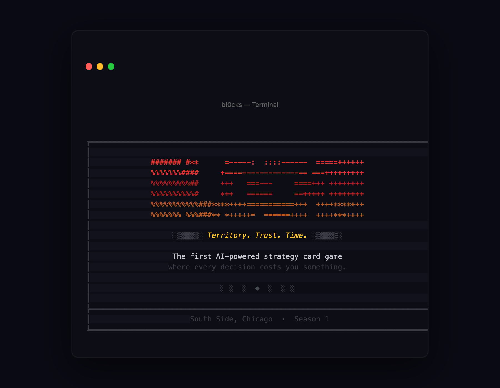
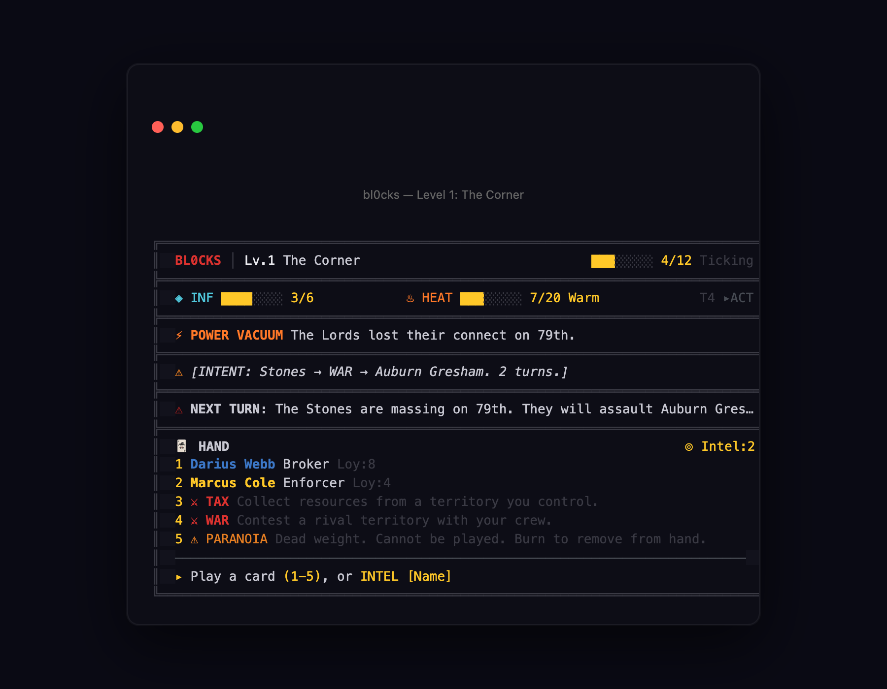
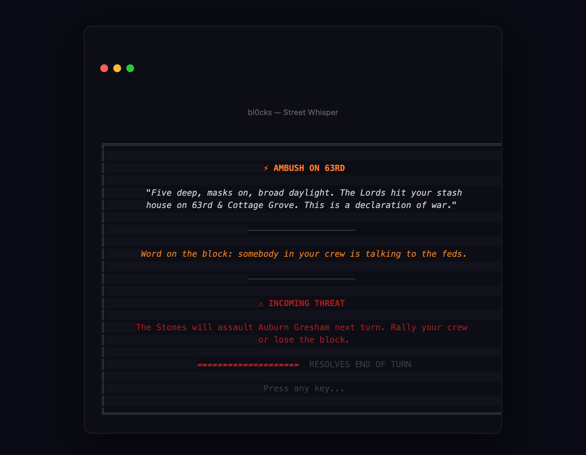
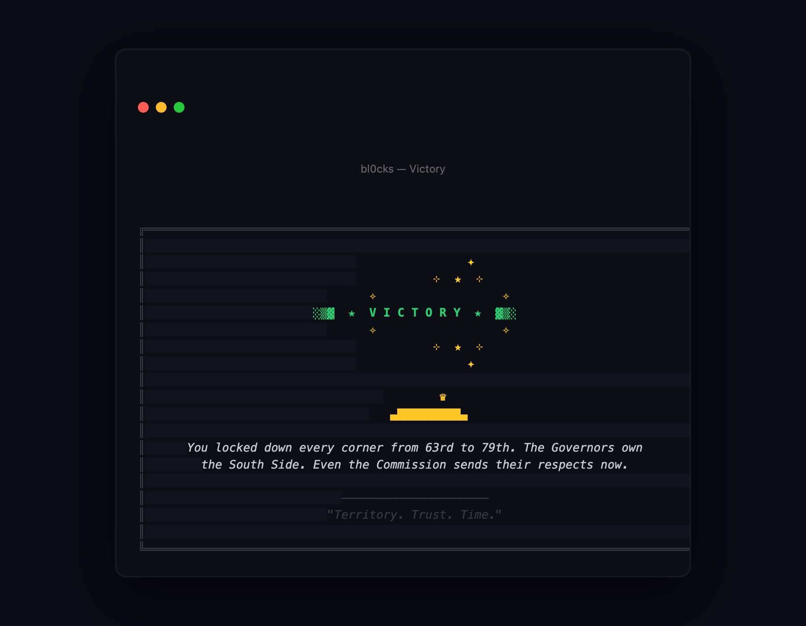

<p align="center">
  
</p>

<h1 align="center">BL0CKS — The AI Strategy Card Game</h1>

<p align="center">
  <strong>Territory. Trust. Time.</strong><br>
  <em>The first strategy card game powered entirely by AI — built with markdown, played in your terminal.</em>
</p>

<p align="center">
  <a href="#-quick-start">Quick Start</a> •
  <a href="#-ai-agent-play">AI Agent Play</a> •
  <a href="#-how-it-works">How It Works</a> •
  <a href="#-screenshots">Screenshots</a> •
  <a href="#-create-your-own-game">Create Your Own</a> •
  <a href="#-architecture">Architecture</a>
</p>

---

## 🤖 100% AI-Built. Bring Your Own Key.

BL0CKS is a **fully AI-built** strategy card game that runs in your terminal. Every game session is powered by **your own AI API key** — Gemini, Claude, OpenAI, or the free Kilo gateway. No server. No subscription. No data collection. **Your key never leaves your machine.**

The entire game world — characters, factions, events, dialogue — is defined in **plain markdown files**. The AI reads them and improvises a unique experience every playthrough. No two games are the same.

> **Think Slay the Spire meets The Wire** — a deck-building strategy game where an AI game master runs the world, characters have hidden motives, and every decision costs something.

### Why BL0CKS?

- 🎮 **Non-deterministic gameplay** — AI generates unique events, dialogue, and outcomes every session
- 🔑 **Bring Your Own Key (BYOK)** — Use any major LLM. Your API key stays local.
- 📝 **Modular markdown content** — All game content is plain `.md` files. Fork and reskin in hours.
- 🏆 **Leaderboard-friendly** — Deterministic scoring (Ticks × 1000 + Territories × 2000 + Loyalty × 500) despite non-deterministic gameplay
- 🖥️ **Immersive terminal UI** — 24-bit color, ASCII card art, screen effects, typewriter narration
- 🧩 **ROM architecture** — Swap entire game worlds like cartridges. Community ROMs welcome.

---

## 🎮 Quick Start

```bash
# Clone and install
git clone https://github.com/officebeats/bl0cks-the-game.git
cd bl0cks-the-game && npm install

# Play
npm start
```

You'll be prompted to choose your AI provider and paste your API key:

| Provider | Key Format | Notes |
|---|---|---|
| **Gemini** | `AIza...` | Recommended — fast, cheap, great at roleplay |
| **Claude** | `sk-ant-...` | Deep narrative, extended thinking |
| **OpenAI** | `sk-...` | GPT-4o, reliable |
| **Kilo** | Free | Shareware gateway — 200 requests/day, no key needed |

> 💡 **Your key is stored locally** in `~/.bl0cks/config.json` and never transmitted anywhere except directly to your chosen AI provider.

---

## 🤖 AI Agent Play

BL0CKS ships with a **self-contained agentic skill** that lets an AI coding assistant (Gemini CLI, Claude Code, Cursor, etc.) play the game directly — no human terminal interaction required.

```
.agents/skills/play_bl0cks/SKILL.md
```

**Two modes:**

| Mode | Description |
|---|---|
| **QA Tester** | The agent runs all 13 levels headlessly via the mock adapter and reports pass/fail. Great for regression testing. |
| **Game Master** | The agent boots the engine with your API key, presents the board as rich narrative in chat, and translates your natural language into game actions. Play BL0CKS entirely from your AI chat window. |

Just tell your agent:

> *Run the Bl0cks Runner skill. Let's do a Game Master match on the Chicago ROM!*

The skill uses the **engine API directly** (`BL0CKS.boot()` → `startLevel()` → `sendAction()`) rather than the CLI, so it works in any non-TTY environment.

---

## 📸 Screenshots

### The Board — Your Command Center

<p align="center">
  
</p>

*Influence bar, Heat meter, enemy intel, and your hand of cards — all in one screen. Plays on any terminal that supports 24-bit color.*

### Street Whisper — Dramatic Event Reveal

<p align="center">
  
</p>

*Before each turn, events and enemy intents are revealed on their own dramatic screen. Press any key when you're ready to see your hand.*

### Victory — Screenshot-Worthy Wins

<p align="center">
  
</p>

*Every win is built to be shared. Star burst pattern, trophy icon, and your unique victory narrative generated by AI.*

---

## 🧠 How It Works

```
┌──────────────┐     ┌──────────────┐     ┌──────────────┐
│  MARKDOWN    │────▶│   ENGINE     │────▶│  YOUR LLM    │
│  ROM FILES   │     │  (Node.js)   │     │  (BYOK)      │
│              │     │              │     │              │
│  • levels/   │     │  Reads .md   │     │  Gemini /    │
│  • world/    │     │  files and   │     │  Claude /    │
│  • prompts/  │     │  builds AI   │     │  OpenAI /    │
│  • cards/    │     │  prompts     │     │  Kilo        │
└──────────────┘     └──────┬───────┘     └──────┬───────┘
                            │                     │
                            ▼                     ▼
                     ┌──────────────┐     ┌──────────────┐
                     │  GAME STATE  │◀────│  AI RESPONSE │
                     │              │     │              │
                     │  Influence   │     │  Events      │
                     │  Heat Meter  │     │  Dialogue    │
                     │  Cards       │     │  Betrayals   │
                     │  Territories │     │  Outcomes    │
                     └──────┬───────┘     └──────────────┘
                            │
                            ▼
                     ┌──────────────┐
                     │  TERMINAL    │
                     │  RENDERER    │
                     │              │
                     │  ASCII cards │
                     │  24-bit color│
                     │  Screen fx   │
                     └──────────────┘
```

### The Markdown-First Design

Every piece of game content is a plain markdown file:

```markdown
# Level 01 — The Corner (roms/chicago/levels/level_01.md)

## Setting
Woodlawn, 63rd & Cottage Grove. Your first day running the block.

## Win Condition
Control 2+ territories by clock tick 12.

## Starting Hand
- Darius Webb (People, Broker, Loyalty: 7)
- Tax (Move, collect resources)
- War (Move, contest territory)
```

The engine reads these files, assembles them into AI prompts, and the LLM generates the game world in real-time. **Want a cyberpunk version? A fantasy kingdom? A corporate thriller?** Just write new markdown files.

---

## 🃏 Core Mechanics

| System | Description |
|---|---|
| **Influence** | Per-turn action budget (3 base, 6 max). Every card costs influence. Use it or lose it. |
| **Heat Meter** | Global escalation tracker: Low → Warm → Hot → On Fire → **Federal**. Too much heat and the feds shut you down. |
| **Enemy Intent** | Slay the Spire-style — rivals telegraph their next move so you can counter or prepare. |
| **Crew Cards** | People with hidden loyalty scores. The AI knows their true motives. You see the loyalty number. Trust it? |
| **Play Cards** | 7 action types: TAX, WAR, RALLY, HUSTLE, SHADOW, FORTIFY, FLIP |
| **Dead Draws** | Status cards that clog your hand. Can't play them — must BURN to remove. |
| **Gambits** | High-risk 3rd option. Hidden stat checks. Irreversible. The AI decides the outcome. |
| **The Ledger** | Cross-level memory. Grudges, debts, and reputation carry forward between levels. |

### The 10-Phase Turn

```
Dawn → Draw → Street Whisper → Scheme → Act → Combo → Burn → Intent → Heat Check → Dusk
```

Every turn follows this sequence. The AI handles it seamlessly — you just play cards and make decisions.

---

## 🧩 Create Your Own Game

BL0CKS uses a **ROM architecture** — the engine is content-agnostic. All game worlds are self-contained packages of markdown files called ROMs.

```bash
# Copy the template
cp -r roms/_template roms/my-cyberpunk-rom

# Edit the files
├── manifest.json          # ROM metadata, faction names, settings
├── levels/                # Level definitions (markdown)
├── world/                 # Factions, territories, lore (markdown)
├── prompts/               # AI system prompts (markdown)
├── cards/                 # Card templates (markdown)
└── assets/
    └── theme.json         # Custom terminal color palette
```

### Custom Theme Colors

Every ROM can define its own terminal palette via `assets/theme.json`:

```json
{
  "palette": {
    "primary": "#00FFFF",
    "accent": "#FF00FF",
    "surface": "#0A0A1A"
  },
  "factions": {
    "netrunners": "#00FFFF",
    "megacorps": "#FF0066"
  }
}
```

### Validate Your ROM

```bash
node tools/rom-validator.mjs roms/my-cyberpunk-rom
```

---

## 🏗️ Architecture

```
bl0cks-the-game/
├── .agents/                   # AI agent skills & tooling
│   └── skills/
│       ├── play_bl0cks/       # Agentic game runner (QA Tester / Game Master)
│       └── rom_audio_prompt/  # Lyria 3 music prompt generator
│
├── engine/                    # Core game engine (content-agnostic)
│   ├── index.js               # Public API: BL0CKS.boot()
│   ├── ai/                    # AI provider routing & adapters
│   │   ├── router.js          #   Provider auto-detection
│   │   ├── prompt-builder.js  #   ROM markdown → AI prompt assembly
│   │   ├── response-parser.js #   AI output → structured game state
│   │   └── adapters/          #   Gemini, Claude, OpenAI, Kilo, Ollama, Mock
│   ├── cards/                 # Card engine (deck, draw, burn, exhaust)
│   ├── core/                  # Game state, phases, influence, heat, combat, scoring
│   ├── content/               # ROM loader: discovery, parsing, validation, DLC merging
│   └── events/                # Engine ↔ Platform event bus
│
├── roms/                      # Game content packages (markdown + JSON)
│   ├── chicago/               # Base ROM: South Side Chicago (12 levels)
│   └── _template/             # Starter kit for community ROMs
│
├── platforms/cli/             # Terminal interface
│   ├── bin/bl0cks.js          # Entry point, alt screen buffer, boot sequence
│   ├── commands/play.js       # Game loop, paged layout, scoring
│   └── lib/
│       ├── renderer.js        # Cell-buffer ASCII renderer (24-bit color)
│       ├── effects.js         # Typewriter, gradients, screen reactions
│       ├── input.js           # Terminal input handling
│       └── menus.js           # Config, provider select, session management
│
└── docs/                      # Game design docs & screenshots
```

### Engine API

```js
import { BL0CKS } from './engine/index.js';

const engine = await BL0CKS.boot('./roms/chicago', { apiKey: 'YOUR_KEY' });
const state = await engine.startLevel('01');
const next = await engine.sendAction('Play Darius Webb on Auburn Gresham');
```

---

## 🖥️ Terminal Features

| Feature | Description |
|---|---|
| **Alternate Screen** | Game runs in its own buffer (like vim). `--no-altscreen` to disable. |
| **Fanned Card Layout** | Parabolic arc with overlap, drop shadows, faction-colored borders |
| **Paged Whisper → Play** | Events shown on dramatic screen before your hand |
| **Contextual Narrator** | `THE BLOCK │ Feds circling.` — reacts to game state |
| **Screen Reactions** | Red flash on betrayal, dim on territory loss, shake on gambit fail |
| **Typewriter Text** | Char-by-char streaming at 15ms for cinematic pacing |
| **24-bit Gradient** | Per-character RGB interpolation on scores and dramatic moments |
| **ROM Theming** | Custom palettes from `assets/theme.json` |
| **720p Optimized** | Every screen fits 80×24 terminal |

---

## 🔌 AI Provider Editions

| Edition | Key | Exclusive Content |
|---|---|---|
| Gemini | `AIza...` | The Wire DLC, prismatic cards |
| Claude | `sk-ant-...` | Deception Arc, extended thinking |
| GPT | `sk-...` | Informant mechanic unlock |
| Kilo | Free | 200 requests/day — no key needed |

---

## 📜 License

MIT — Fork it. Reskin it. Make it yours.

The engine is the product. The world is the canvas.

---

<p align="center">
  <em>Built entirely with AI assistance. Every line of code, every game mechanic, every pixel of ASCII art.</em><br>
  <strong>Created by <a href="https://github.com/officebeats">Ernesto "Beats" Rodriguez</a></strong>
</p>

<p align="center">
  <strong>Keywords:</strong> ai game, terminal game, cli game, strategy card game, slay the spire, bring your own key, byok, llm game, ai powered game, ascii art game, markdown game, modular game engine, gemini game, claude game, openai game, roguelike, deck builder, node.js game
</p>
