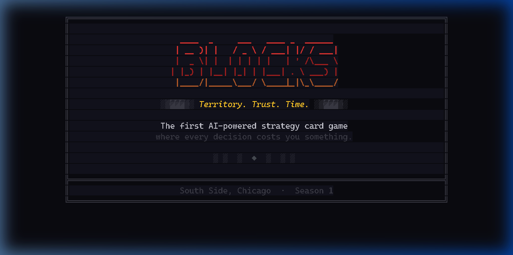
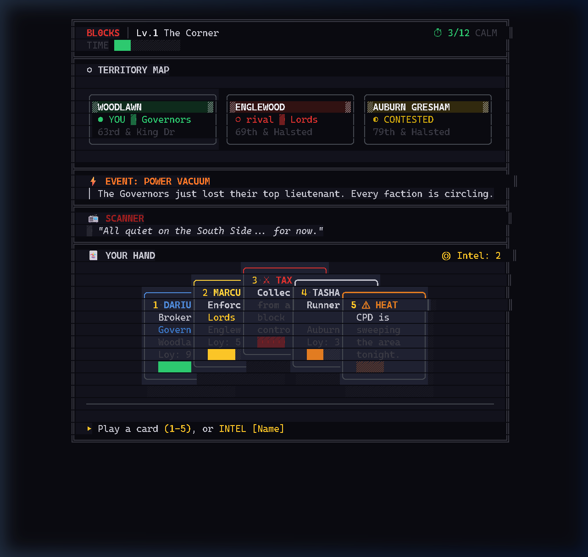
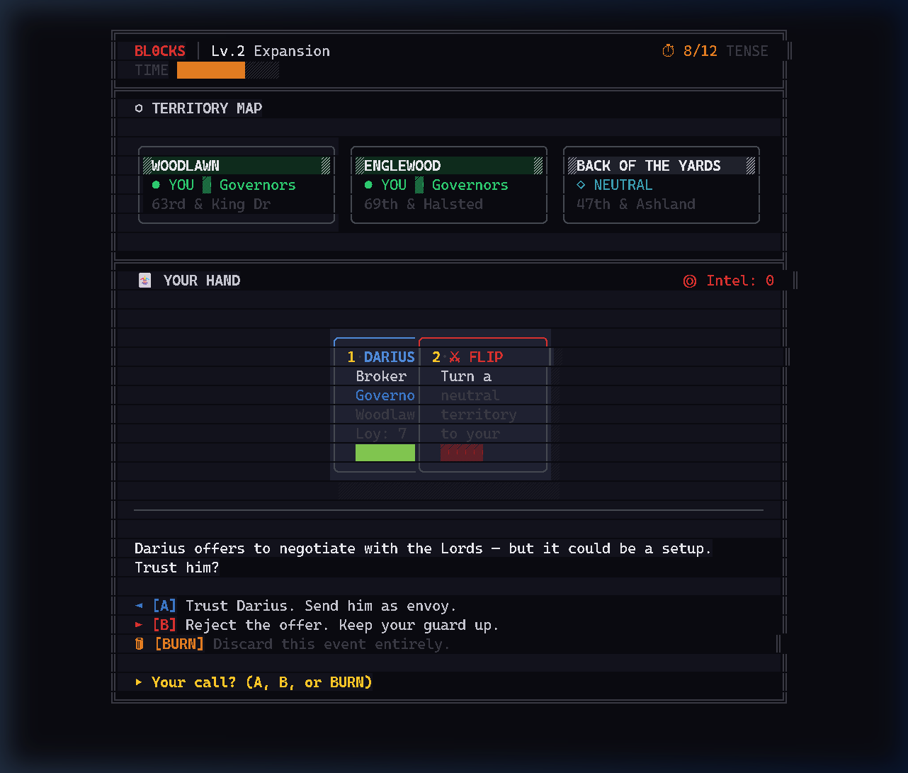
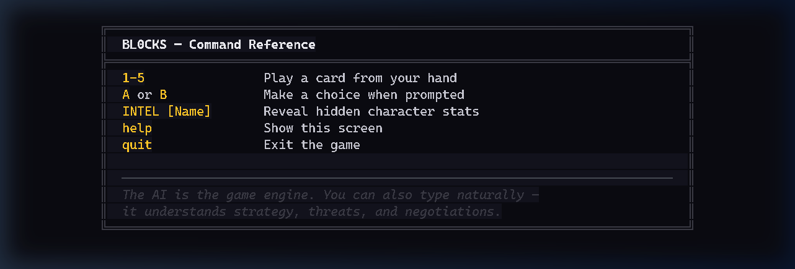
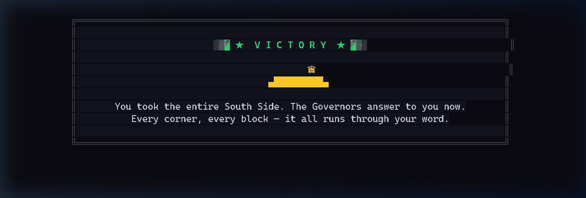

<div align="center">

```text
  ____  _  ___       _         
 | __ )| |/ _ \  ___| | _____  
 |  _ \| | | | |/ __| |/ / __| 
 | |_) | | |_| | (__|   <\__ \ 
 |____/|_|\___/ \___|_|\_\___/ 
```

### Territory. Trust. Time.

**The first AI-powered strategy card game where every decision costs you something.**

[](https://www.npmjs.com/package/bl0cks)
[](https://opensource.org/licenses/MIT)

<br>

*A game about loyalty, deception, and the price of power on Chicago's South Side.*

</div>

<br>

---

## 🎮 Play Now

BL0CKS runs in your terminal. Bring your own AI — choose Claude, Gemini, or ChatGPT.

### Step 1 — Install a JavaScript Runtime

You need **Bun** (recommended) or **Node.js** installed. Pick one:

<details open>
<summary><strong>🍎 macOS</strong></summary>

**Option A — Install Bun (recommended, fastest):**
```bash
curl -fsSL https://bun.sh/install | bash
```

**Option B — Install Node.js:**
```bash
# Using Homebrew
brew install node

# Or download the installer from https://nodejs.org/
```

</details>

<details>
<summary><strong>🐧 Linux</strong></summary>

**Option A — Install Bun (recommended, fastest):**
```bash
curl -fsSL https://bun.sh/install | bash
```

**Option B — Install Node.js:**
```bash
# Ubuntu / Debian
sudo apt update && sudo apt install nodejs npm

# Fedora
sudo dnf install nodejs npm

# Or use the official installer: https://nodejs.org/
```

</details>

<details>
<summary><strong>🪟 Windows</strong></summary>

**Option A — Install Bun (recommended, fastest):**
```powershell
powershell -c "irm bun.sh/install.ps1 | iex"
```

**Option B — Install Node.js:**

Download and run the installer from **[nodejs.org](https://nodejs.org/)** — choose the LTS version.

> **Tip:** Use [Windows Terminal](https://aka.ms/terminal) for the best visual experience with BL0CKS.

</details>

<br>

### Step 2 — Play

Once your runtime is installed, open a terminal and run:

```bash
# If you installed Bun
bunx bl0cks

# If you installed Node.js
npx bl0cks
```

That's it. The game downloads, launches, and walks you through setup.

> **Want it permanently installed?** Run one of these instead:
> ```bash
> bun install -g bl0cks    # then just run: bl0cks
> npm install -g bl0cks    # then just run: bl0cks
> ```

<br>

### 🔑 You'll Need an API Key

The game is powered by **your** AI. Grab a free key from any provider:

| Provider | Get Your Key | Edition |
|---|---|---|
| **Google Gemini** | [aistudio.google.com/app/apikey](https://aistudio.google.com/app/apikey) | Gemini Edition |
| **Anthropic Claude** | [console.anthropic.com/settings/keys](https://console.anthropic.com/settings/keys) | Claude Edition |
| **OpenAI ChatGPT** | [platform.openai.com/api-keys](https://platform.openai.com/api-keys) | GPT Edition |

Your key is stored locally on your machine (`~/.bl0cks/config.json`) and never sent anywhere except directly to your chosen AI provider.

---

## What Is BL0CKS?

BL0CKS is a strategy card game set on the streets of Chicago's South Side. You play as a rising figure navigating a world of shifting alliances, hidden agendas, and rival factions — all fighting for control of the same territory.

Every character you meet has a face they show you — and a truth they're hiding.

The catch? **The AI running the game knows everything. You don't.**

Your job is to figure out who's loyal, who's lying, and who's about to flip on you — before the clock runs out.

---

## Screenshots

<div align="center">

### Splash Screen


### Game Board — 5-Card Fanned Hand


### Choice Prompt


### Help & Commands


### Victory


</div>

---

## How It Works

**🃏 Play cards to decide.** Every turn, you're dealt a situation. Choose A or B. Each choice has consequences that ripple across the board — alliances shift, territory changes hands, and the people around you remember what you did.

**🗺️ Control the blocks.** The game board is a map of real South Side neighborhoods. You gain and lose territory through strategy, negotiation, and sometimes war. Every block you hold is a block someone else wants.

**🔒 Trust no one.** Every character has visible stats — loyalty, role, faction. But underneath, they have hidden motives that only the AI knows. You can spend rare Intel Cards to peek behind the curtain... but you never have enough of them.

**⏱️ Beat the clock.** Every action costs time. While you're thinking, rival factions are moving. The police scanner is ticking. You have 20 minutes to make your play before the board shifts without you.

---

## CLI Commands

### Playing the Game
| Command | Action |
|---|---|
| `bl0cks` | Play Level 1: "The Corner" |
| `bl0cks play 2` | Play Level 2: "The Wire" (Defensive Scenario) |
| `bl0cks play <file.md>` | Play a custom markdown level |
| `1` – `5` | Play a card from your hand |
| `A`, `B`, or `BURN` | Make a choice when prompted |
| `INTEL [Name]` | Spend an Intel Card to reveal hidden stats |
| `help` | Show all in-game commands |
| `quit` | Exit the game |

> The AI is the game engine. You can also type naturally — it understands strategy, threats, and negotiation.

### The Streets (Cloud Network)
| Command | Action |
|---|---|
| `bl0cks cloud login` | Enter your Supabase keys for live network access |
| `bl0cks market browse` | View available community campaigns |
| `bl0cks market install <id>` | Download a community cartridge |
| `bl0cks leaderboard [id]` | View the top scores for a specific cartridge |

---

## What Makes BL0CKS Different

### 🤖 Powered By Your AI

BL0CKS doesn't lock you into one AI service. **You bring your own.** Connect your Claude, Gemini, or ChatGPT account and the game adapts to your model's strengths. Better AI means deeper stories, smarter characters, and more unpredictable betrayals.

### 🎴 No Two Games Are The Same

The AI generates hidden character motives, secret allegiances, and betrayal conditions fresh every session. You can't memorize the game. You can only learn to read it.

### 🛠️ Build Your Own Cards

BL0CKS isn't just a game — it's a **game factory**. Describe a character in plain English and the AI builds a complete, playable card with hidden stats, decision scenarios, and custom artwork. Bundle your cards into packs. Share them with the community. See what others have built.

### 🌍 Fork the Whole World

The entire game world — factions, territories, characters, art style — is designed to be swapped out. Someone will rebuild this as a corporate espionage thriller. Someone else will set it in a medieval court. **The engine stays the same. The world is yours.**

---

## The Factions

<div align="center">

| | Faction | Style | Color |
|---|---|---|---|
| 🔵 | **The Governors** | Expand or die. Pure board control. | Blue |
| 🟡 | **The Lords** | Political. Alliance brokers. | Gold |
| 🔴 | **The Stones** | Unpredictable. Chaos agents. | Red |
| ⚫ | **The Commission** | The endgame. No one sees them coming. | Black |
| ⬜ | **The Law** | Always watching. Never on your side. | Gray |

</div>

---

## The Pillars

Every mechanic in the game serves one of three pillars. If it doesn't touch at least one, it doesn't belong.

> **🏘️ Territory** — The block is the unit of power. Geography isn't decoration — it's the board.

> **🤝 Trust** — Everyone has a visible loyalty score and a hidden truth. The gap between them is where the game lives.

> **⏳ Time** — Every decision costs clock ticks. Hesitate too long and the world moves without you.

---

## Roadmap

- [x] Game Design Document v3.0
- [x] CLI game engine — bring your own LLM
- [x] Published to npm — `bunx bl0cks`
- [x] Polished CLI renderer — Termcraft-grade ASCII art with fanned card hand
- [ ] Full 12-level campaign (Act I–III)
- [ ] Card Creation Engine
- [ ] Visual mobile app
- [ ] Multiplayer — PvP hidden-loyalty mode

---

## For Developers & Creators

BL0CKS is built on **Markdown files**. Every card, every character, every level is a `.md` file that the AI reads and brings to life. The entire game world is open and forkable.

Want to build your own version? Clone the repo, swap the world files, keep the engine.

```
/world/territories.md    ← Your neighborhoods
/world/factions.md       ← Your power players  
/levels/                 ← Your story
/app/                    ← The game engine
```

Full architecture details are in the [Game Design Document](GDD.md).

---

<div align="center">

### 🔴 BL0CKS

**A game about trust in a world where everyone's playing their own game.**

Built by [Ernesto "Beats" Rodriguez](https://github.com/officebeats)

---

```bash
bunx bl0cks
```

*Play now. Trust no one.*

</div>
